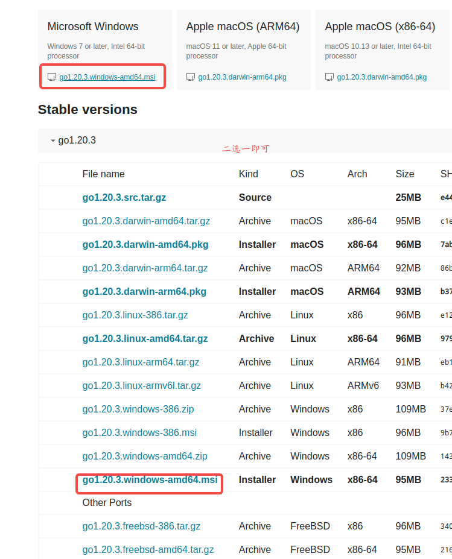
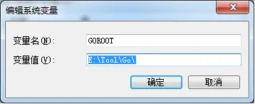
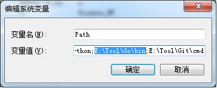
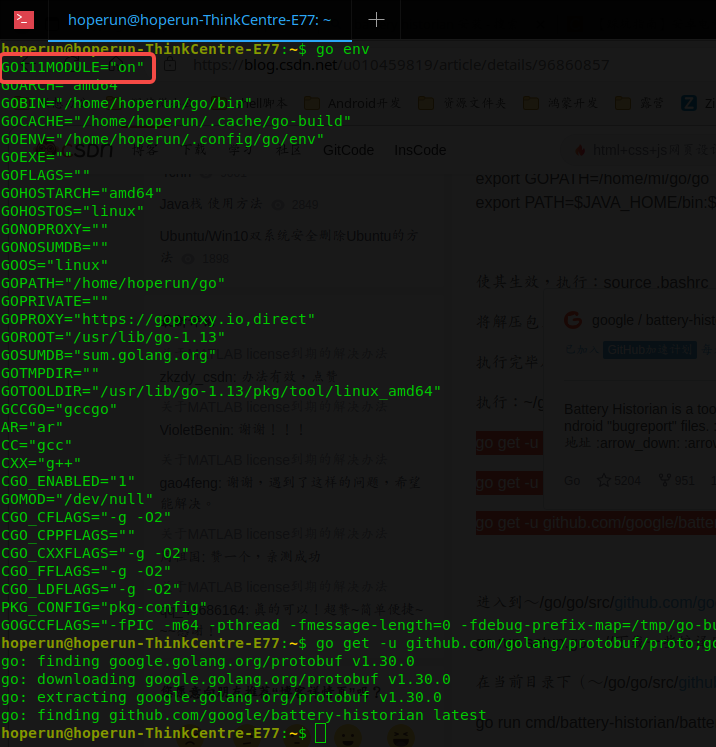
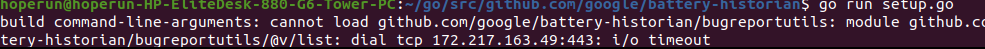
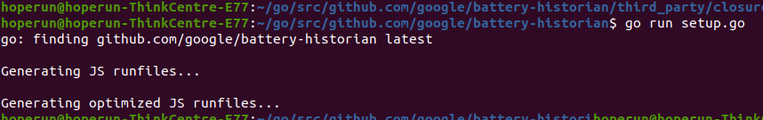
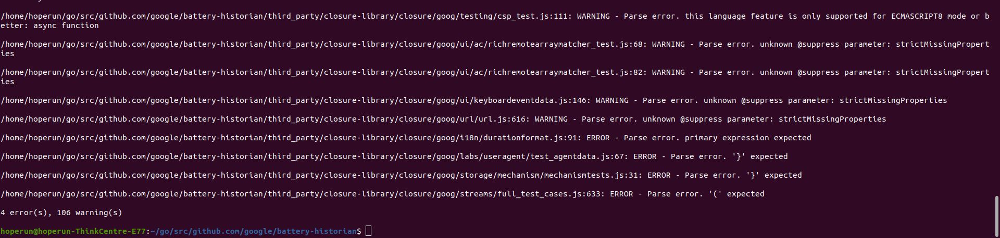
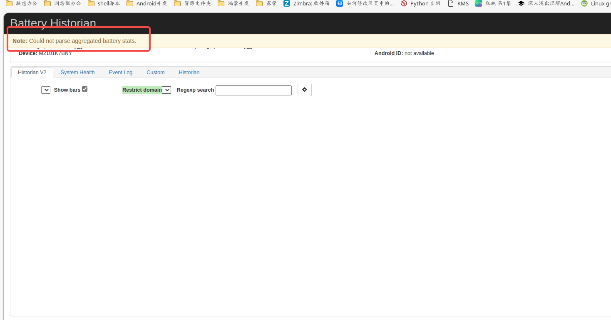
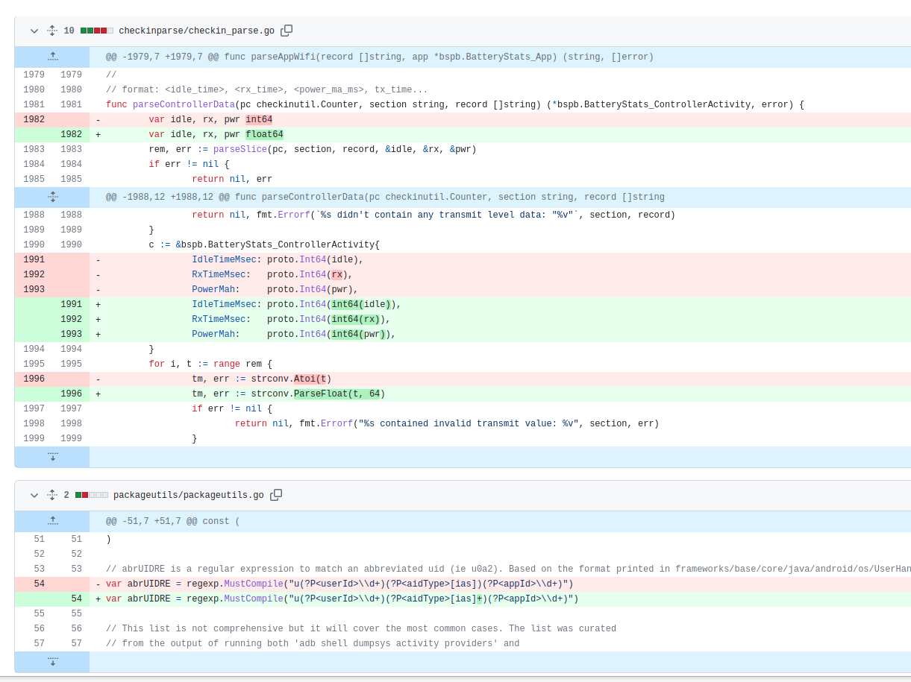

# 前言

Battery Historian是谷歌推出的一款专门分析bugreport的开源工具，具体使用事项可以阅读[《使用 Battery Historian 分析耗电情况》](https://developer.android.google.cn/topic/performance/power/battery-historian?hl=zh-cn)

# 前置环境安装

本文是基于代码编译，使用Docker的环境存在三个问题：

1.几乎所有的镜像都是外网的；

2.依赖别人的环境指不定哪天就崩了；

3.别人得环境不一定实时更新，可能不兼容最新版本。

需要安装的环境有：Go、git、python、java。

## 一、Ubuntu环境下

### 1.安装Go语言

1）sudo add-apt-repository ppa:gophers/go（用于配置下载源）

2）sudo apt-get update（将下载源部署）

3）sudo apt-get install golang（安装golang）

4）安装完之后配置环境变量 `gedit ~/.bashrc`，如果没有这个文件可以使用`cp /etc/skel/.bashrc ~/`从系统中拷贝一份出来，在文档末尾添加

```shell
export GOPATH=~/go
export PATH=$GOPATH/bin:$PATH
```

5）source .bashrc

### 2.安装git

sudo apt-get install git

### 3.安装python2.7

sudo apt-get install python2.7

### 4.安装java

1）从[官网](https://www.oracle.com/java/technologies/downloads/#java8)下载java.tar.gz.;

2）使用`tar -zxvf java.tar.gz -C xxx`

3）

```shell
xxx就是上一步中的文件路径
sudo update-alternatives --install /usr/bin/java java xxx/bin/java 1000
sudo update-alternatives --install /usr/bin/javac javac xxx/bin/javac 1000
sudo update-alternatives --install /usr/bin/javaws javaws xxx/bin/javaws 1000
```

## 二、windows环境下

### 1.安装Go语言

1）前往官网https://golang.google.cn/dl/ 下载



2）配置GOROOT和GOPATH（注意环境变量的配置)

a. GOROOT的作用是告诉Go 命令和其他相关工具，在哪里去找到安装在你系统上的Go包,所以这里配置的是GO的安装目录



b.GOPATH可以简单理解为是工程的目录，所以创建一个GO的工程路径


C.最后配置一下环境变量，把Go的bin目录放到path环境变量中



### 2.安装python2.7

1）去[官网](https://www.python.org/downloads/release/python-2716/)下在安装包；

2）剩下得步骤略；

### 3.安装java

### 4.安装git

# 正式安装

在正式开始安装前，最好配备一个VPN，因为下面所有的下载都需要上github，众周之的原因，或者使用`go env -w GOPROXY=https://goproxy.cn,direct`命令改成国内下载源。如果只想使用battery historian，且不需要随时迭代的话，可以直接前往笔者的[github](https://github.com/Edith-xiyue/Battery-Historian-installation-tutorial)下载，将其中的`src`文件夹放入“GOPATH”文件夹下。这个文件夹中是已经全编译的环境，可以直接进入`src/github.com/google/battery-historian/`中使用`go run cmd/battery-historian/battery-historian.go`运行battery historian。

1.使用`go env`查看环境，如果GO111MODULE不为"off"，则使用`go env -w GO111MODULE=off`更改为GO111MODULE="off"，如果没有GO111MODULE变量，则表明go版本较低，是用`go version`查看版本，只要1.10以上就可以不用关注，如果版本过低，可以参考[《Ubuntu安装go/升级go版本【转载】》](https://zhuanlan.zhihu.com/p/453462046)进行版本升级；



2.使用如下命令下载Battery Historian源码及其编译所需的环境（如果无法正常下载，可以前往笔者的[github](https://github.com/Edith-xiyue/Battery-Historian-installation-tutorial)上手动下载，将其中得`src.zip`文件解压后放入“GOPATH”文件夹下）；

```shell
go get -u github.com/golang/protobuf/proto
go get -u github.com/golang/protobuf/protoc-gen-go
go get -u github.com/google/battery-historian/...
```

3.进入到前面配置的“GOPATH”文件目录中，并进入其中的`src/github.com/google/battery-historian`；

4.使用`go env -w GO111MODULE=on`更改GO111MODULE为on；

5.使用`go run setup.go`开始编译（出现下图中类似得`i/o timeout`表明无法正常下载，可以前往[closure-library](https://github.com/google/closure-library)自行下载，并放入`src/github.com/google/battery-historian/third_party`中，如果还是报相同错误，说明你的电脑环境完全不能上github，还请下载`src`文件夹进行替换）；



6.出现下图后就表明编译成功，可以使用`go run cmd/battery-historian/battery-historian.go`运行battery historian。



# 可能存在的问题

1.使用`go run setup.go`编译battery historian可能报错js error，如下图所示，不一定完全一样：



可以前往[no-ssr-battery-historian](https://github.com/gusha915/no-ssr-battery-historian)下载必要的环境（如果下载的是笔者的代码，no-ssr-battery-historian存放在`src/github.com/google/`中），将其中的cdn文件夹放入`src/github.com/google/battery-historian/third_party`中，将其中的`base.html`替换掉`src/github.com/google/battery-historian/templates`中的`base.html`，如果进行完以上操作后仍然报js编译异常，可使用`go env`查看GO111MODULE是否为on，若为on，则使用`go env -w GO111MODULE=off`改为off。

2.打开bugreport后，没有折线图，并且网页弹窗提醒`Note: Could not parse aggregated battery stats.`，可以参考[lilydjwg/battery-historian](https://github.com/lilydjwg/battery-historian/commit/a912fa0ee57a9dba00d8fd37a9516c0bc11751ed)的提交：




