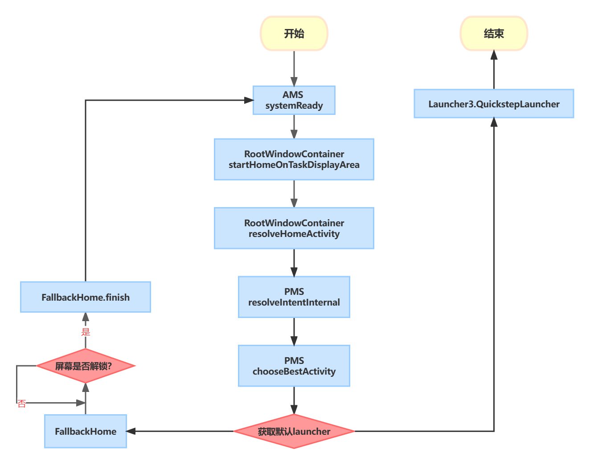
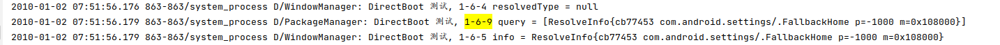
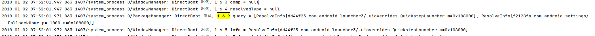

由于数据库这块还未研究透彻，本文暂不涉及

# 一 Launcher3主要类简介

- **Launcer** 是显示Launcher的主Activity。我们看到的桌面就是它，是最核心且唯一的Activity。
- **LauncherAppState**：单例对象，构造方法中初始化对象、注册应用安装、卸载、更新，配置变化等广播。这些广播用来实时更新桌面图标等，其receiver的实现在LauncherModel类中，LauncherModel也在这里初始化。
- **LauncherModel**：数据处理类，保存桌面状态，提供读写数据库的API，内部类LoaderTask用来初始化桌面。
- **InvariantDeviceProfile**：一些不变的设备相关参数管理类，其内部包涵了横竖屏模式的DeviceProfile。
- **IconCache**：图标缓存类，应用程序icon和title的缓存，内部类创建了数据库app_icons.db。
- **LauncherProvider**：核心数据库类，负责launcher.db的创建与维护。
- **DragLayer**：一个用来负责分发事件的ViewGroup。
- **DragController**：DragLayer只是一个ViewGroup，具体的拖拽的处理都放到了DragController中。
- **BubblTextView**：图标都基于他，继承自TextView。
- **Folder**：打开文件夹展示的View。
- **FolderIcon**：文件夹图标。
- **ItemInfo**：桌面上每个Item的信息数据结构，包括在第几屏、第几行、第几列、宽高等信息；该对象与数据库中记录一一对应；该类有多个子类，譬如FolderIcon的FolderInfo、BubbleTextView的ShortcutInfo等。
- **Workspace**：显示Launcher界面的视图。
- **CellLayout**：Workspace中显示多页，每一页就是一个CellLayout。
- **ShortcutAndWidgetContainer**：CellLayout中存放子View（即应用图标或小控件）的ViewGroup，即真正包含子View的容器。
- **Hotseat**：Workspace下的快捷栏。

# 二 Launcher3启动前

在android7之后引入了一个DirectBootMode，该模式是开机自动进入的一个模式，在该模式下，需要在manifest里面配置android:directBootAware=true才能在该模式下正常运行，该模式在用户解锁屏幕（如果没有设置锁屏在开机会会自动识别为屏幕已经解锁）后会自动退出，且ACTION_BOOT_COMPLETED开机广播是在该模式退出后才会发出。

进入Launcher3的manifest会发现android:directBootAware=false，按理说launcher3无法启动，但是实际上我们会进行锁屏页面，后来经过代码追踪（网上找教程），发现settings中有一个FallbackHome类，也配置了Launcher属性，且android:directBootAware=true：

```java
<application android:label="@string/settings_label"
        android:icon="@mipmap/ic_launcher_settings"
        ............
        android:directBootAware="true">

    <!-- Triggered when user-selected home app isn't encryption aware -->
    <activity android:name=".FallbackHome"
              android:excludeFromRecents="true"
              android:theme="@style/FallbackHome">
        <intent-filter android:priority="-1000">
            <action android:name="android.intent.action.MAIN" />
            <category android:name="android.intent.category.HOME" />
            <category android:name="android.intent.category.DEFAULT" />
        </intent-filter>
    </activity>
```

进入FallbackHome我们会发现如下代码：

```java
    private BroadcastReceiver mReceiver = new BroadcastReceiver() {
        @Override
        public void onReceive(Context context, Intent intent) {
            maybeFinish();
        }
    };

    @Override
    protected void onCreate(Bundle savedInstanceState) {
        super.onCreate(savedInstanceState);
        ...

        //设置监听ACTION_USER_UNLOCKED广播，该广播会在用户解锁屏幕后发出
        registerReceiver(mReceiver, new IntentFilter(Intent.ACTION_USER_UNLOCKED));
        //调用条件判断函数
        maybeFinish();
    }

    private void maybeFinish() {
        //用于判断设备是否已经解锁
        if (getSystemService(UserManager.class).isUserUnlocked()) {
            final Intent homeIntent = new Intent(Intent.ACTION_MAIN)
                    .addCategory(Intent.CATEGORY_HOME);
            final ResolveInfo homeInfo = getPackageManager().resolveActivity(homeIntent, 0);
            //用于查找当前设备中是否存在其它launcher应用，若没有则延迟500ms后再查找，若有，则直接finsh自身
            if (Objects.equals(getPackageName(), homeInfo.activityInfo.packageName)) {
                if (UserManager.isSplitSystemUser()
                        && UserHandle.myUserId() == UserHandle.USER_SYSTEM) {
                    return;
                }
                Log.d(TAG, "User unlocked but no home; let's hope someone enables one soon?");
                mHandler.sendEmptyMessageDelayed(0, 500);
            } else {
                Log.d(TAG, "User unlocked and real home found; let's go!");
                getSystemService(PowerManager.class).userActivity(
                        SystemClock.uptimeMillis(), false);
                finish();
            }
        }
    }

    private Handler mHandler = new Handler() {
        @Override
        public void handleMessage(Message msg) {
            maybeFinish();
        }
    };
```

有读者此时可能会问，我直接在launcher3里面把directBootAware改成true不就行了，为什么要到settings里面绕一圈呢？我一开始也是这么想的，直到我在查资料的时候找到一篇文章，才发现，launcher3里面是会展示widget的需求的，而这些widget是和三方应用交互的，如果这些三方应用没有配置directBootAware为true，这些应用就会无法正常启动，就会让launcher3绘制widget异常（因为widget绘制时是需要和提供widget的应用进行数据交互，如果该应用未配置directBootAware，就会导致数据交互异常），从而导致launcher3启动失败，那么系统就会一直卡在开机动画后。

# 三 系统启动launcher3流程

流程图如下：



在android11上，系统启动ActivityManagerService后（以下简称AMS），AMS的systemReady中会调用”mAtmInternal.startHomeOnAllDisplays(currentUserId, "systemReady");“经过一系列调用(ActivityTaskManagerService.startHomeOnAllDisplays -> RootWindowContainer.startHomeOnAllDisplays -> RootWindowContainer.startHomeOnDisplay(int, String, int) -> RootWindowContainer.startHomeOnDisplay(int, String, int, boolean) -> RootWindowContainer.startHomeOnTaskDisplayArea())，最终进入”ActivityStartController.startHomeActivity()“，在这整个过程中，我们需要关注的就是RootWindowContainer.startHomeOnTaskDisplayArea()中的resolveHomeActivity()调用：

```java
boolean startHomeOnTaskDisplayArea(int userId, String reason, TaskDisplayArea taskDisplayArea,
        boolean allowInstrumenting, boolean fromHomeKey) {
    ...
        homeIntent = mService.getHomeIntent();
        aInfo = resolveHomeActivity(userId, homeIntent);
    ...
    mService.getActivityStartController().startHomeActivity(homeIntent, aInfo, myReason,
            taskDisplayArea);
    return true;
}

ActivityInfo resolveHomeActivity(int userId, Intent homeIntent) {
    ...
        //经过验证，resolvedType为null
            final String resolvedType =
                    homeIntent.resolveTypeIfNeeded(mService.mContext.getContentResolver());
            final ResolveInfo info = AppGlobals.getPackageManager()
                    .resolveIntent(homeIntent, resolvedType, flags, userId);
    ...
}
```

resolveIntent在PackageManagerService（以下简称PMS）中，最终会调用”resolveIntentInternal()“

```java
private ResolveInfo resolveIntentInternal(Intent intent, String resolvedType, int flags,
        @PrivateResolveFlags int privateResolveFlags, int userId, boolean resolveForStart,
        int filterCallingUid) {
    ...
        //权限校验
        mPermissionManager.enforceCrossUserPermission(callingUid, userId,
                false /*requireFullPermission*/, false /*checkShell*/, "resolve intent");
    	...
        //查询所有符合条件的ResolveInfo，刚启动的时候因为只有Settings能启动，所以只有一个FallbackHome，屏幕解锁后重新搜索才会找到FallbackHome及launcher3。
        final List<ResolveInfo> query = queryIntentActivitiesInternal(intent, resolvedType,
                flags, privateResolveFlags, filterCallingUid, userId, resolveForStart,
                true /*allowDynamicSplits*/);
    	...
        final ResolveInfo bestChoice =
                chooseBestActivity(
                        intent, resolvedType, flags, privateResolveFlags, query, userId,
                        queryMayBeFiltered);
    	...
        return bestChoice;
    } finally {
        Trace.traceEnd(TRACE_TAG_PACKAGE_MANAGER);
    }
}
```





在chooseBestActivity中会进行条件判断，由于FallbackHome的优先级为-1000，导致FallbackHome和Launcher3同时被检索到时会自动选择Launcher3而且不会弹出选择框让用户选择。

```java
private ResolveInfo chooseBestActivity(Intent intent, String resolvedType,
        int flags, int privateResolveFlags, List<ResolveInfo> query, int userId,
        boolean queryMayBeFiltered) {
    ...
            if (r0.priority != r1.priority
                    || r0.preferredOrder != r1.preferredOrder
                    || r0.isDefault != r1.isDefault) {
                return query.get(0);
            }
    ...
}
```

# 四 Launcher3启动流程

## 1.Launcher.onCreate（初始化）

初始化对象、加载布局、注册一些事件监听、以及开启数据加载，其中launcher最核心的内容就是数据加载模块；

```java
protected void onCreate(Bundle savedInstanceState) {
    ...
    //LauncherAppState里面保存了一些比较常用的对象，方便其他地方通过单例来获取，比如IconCache（图标缓存）、LauncherModel（负责数据加载和处理各种回调）等。
    LauncherAppState app = LauncherAppState.getInstance(this);
    ...
    mDragController = new DragController(this);
    //AllApp页面过渡动画控制器
    mAllAppsController = new AllAppsTransitionController(this);
    //应该是用来控制当前过渡动画状态
    mStateManager = new StateManager<>(this, NORMAL);
    //初始化View
    mOnboardingPrefs = createOnboardingPrefs(mSharedPrefs);
    mAppWidgetManager = new WidgetManagerHelper(this);
    mAppWidgetHost = new LauncherAppWidgetHost(this,
            appWidgetId -> getWorkspace().removeWidget(appWidgetId));
    mAppWidgetHost.startListening();
    inflateRootView(R.layout.launcher);
    setupViews();
    //应用shortcuts（长按应用后弹出的快捷菜单）存储数据的类
    mPopupDataProvider = new PopupDataProvider(this::updateNotificationDots);
    //AllApp页面过渡动画管理器
    mAppTransitionManager = LauncherAppTransitionManager.newInstance(this);
    mAppTransitionManager.registerRemoteAnimations();
	...
    //this代指src/com/android/launcher3/model/BgDataModel.Callbacks，这个类很重要，贯穿整个数据加载流程
    if (!mModel.addCallbacksAndLoad(this)) {
        if (!internalStateHandled) {
            mDragLayer.getAlphaProperty(ALPHA_INDEX_LAUNCHER_LOAD).setValue(0);
        }
    }
    ...
}
```

## 2.Launcher3.setupViews（UI绘制）

```java
protected void setupViews() {
    ...
    //关于桌面拖动动画
    mDragLayer.setup(mDragController, mWorkspace);
    mWorkspace.setup(mDragController);
    //使用到的对象用于控制壁纸滑动
    mWorkspace.lockWallpaperToDefaultPage();
    //在内部会通过FeatureFlags.QSB_ON_FIRST_SCREEN判断是否代码创建谷歌搜索框，若需要则会自动创建第0屏
    mWorkspace.bindAndInitFirstWorkspaceScreen(null /* recycled qsb */);
    mDragController.addDragListener(mWorkspace);
    ...
}
```


## 3.LauncherModel.startLoader（启动loader子线程）

调用流程Launcher.onCreate -> LauncherModel.addCallbacksAndLoad() -> LauncherModel.startLoader -> LauncherModel.startLoaderForResults

```java
public boolean startLoader() {
    //mModelLoaded会在全流程走完后置为true，mIsLoaderTaskRunning则会在子线程走完后置为false
            if (mModelLoaded && !mIsLoaderTaskRunning) {
                ...
                return true;
            } else {
                startLoaderForResults(loaderResults);
            }
    ...
    return false;
}

public void startLoaderForResults(LoaderResults results) {
    synchronized (mLock) {
        stopLoader();
        mLoaderTask = new LoaderTask(mApp, mBgAllAppsList, mBgDataModel, results);
        MODEL_EXECUTOR.post(mLoaderTask);
    }
}
```

## 4.LoaderTask.run

```java
public void run() {
    ...
    try (LauncherModel.LoaderTransaction transaction = mApp.getModel().beginLoader(this)) {
        List<ShortcutInfo> allShortcuts = new ArrayList<>();
        //从数据库中加载所有的桌面快捷方式，比如分享到桌面的图片、文件，桌面应用快捷方式等
        loadWorkspace(allShortcuts);
        logger.addSplit("loadWorkspace");

        verifyNotStopped();
        //完成workspace的初始化
        mResults.bindWorkspace();
        logger.addSplit("bindWorkspace");

        //疑似发送在第0屏上安装应用的广播
        sendFirstScreenActiveInstallsBroadcast();
        logger.addSplit("sendFirstScreenActiveInstallsBroadcast");
        ...
        //从LauncherApps中加载设备中所有的APP
        List<LauncherActivityInfo> allActivityList = loadAllApps();
        logger.addSplit("loadAllApps");
		//将获取到的设备中所有的APP绑定到AllApp page
        verifyNotStopped();
        mResults.bindAllApps();
        logger.addSplit("bindAllApps");

        verifyNotStopped();
        //疑似是关于应用图标缓存的handler
        IconCacheUpdateHandler updateHandler = mIconCache.getUpdateHandler();
        //疑似会进行应用图标缓存的延迟获取，比如有的应用还处在安装过程中
        setIgnorePackages(updateHandler);
        //更新图标
        updateHandler.updateIcons(allActivityList,
                LauncherActivityCachingLogic.newInstance(mApp.getContext()),
                mApp.getModel()::onPackageIconsUpdated);
        ...
        //加载长按应用弹出的应用快捷菜单
        List<ShortcutInfo> allDeepShortcuts = loadDeepShortcuts();
        logger.addSplit("loadDeepShortcuts");

        verifyNotStopped();
        //绑定长按应用弹出的应用快捷菜单
        mResults.bindDeepShortcuts();
        logger.addSplit("bindDeepShortcuts");

        if (FeatureFlags.ENABLE_DEEP_SHORTCUT_ICON_CACHE.get()) {
            verifyNotStopped();
            logger.addSplit("save deep shortcuts in icon cache");
            //更新图标
            updateHandler.updateIcons(allDeepShortcuts,
                    new ShortcutCachingLogic(), (pkgs, user) -> { });
        }

        //疑似加载launcher自身的widget
        ...
        //结束所有的数据加载
        if (FeatureFlags.FOLDER_NAME_SUGGEST.get()) {
            loadFolderNames();
        }

        verifyNotStopped();
        updateHandler.finish();
        logger.addSplit("finish icon update");

        transaction.commit();
    } catch (CancellationException e) {
        // Loader stopped, ignore
        logger.addSplit("Cancelled");
    } finally {
        logger.dumpToLog();
    }
    TraceHelper.INSTANCE.endSection(traceToken);
}
```

## 5.LoaderTask.loadWorkspace

```java
protected void loadWorkspace(List<ShortcutInfo> allDeepShortcuts, Uri contentUri) {
    boolean clearDb = false;
    try {
        //加载旧数据库
        ImportDataTask.performImportIfPossible(context);
    } catch (Exception e) {
        clearDb = true;
    }
    ...
    //确认是否需要清除数据库 
    ...
    //从default_workspace_xxx.xml中加载数据
    //流程为LauncherProvider.call() -> LauncherProvider.loadDefaultFavoritesIfNecessary() -> LauncherProvider.DatabaseHelper.loadFavorites() -> AutoInstallsLayout.loadLayout() -> AutoInstallsLayout.parseLayout() -> AutoInstallsLayout.parseAndAdd() -> AutoInstallsLayout.parseAndAddNode() -> TagParser.parseAndAdd()
    //loadDefaultFavoritesIfNecessary中会根据sp.getBoolean(EMPTY_DATABASE_CREATED, false)来确定是否需要从xml中读取默认数据。
    LauncherSettings.Settings.call(contentResolver,
            LauncherSettings.Settings.METHOD_LOAD_DEFAULT_FAVORITES);
    //将数据库中的数据存入mBgDataModel中
    synchronized (mBgDataModel) {
    	...
    	//LoaderCursor.checkAndAddItem() -> LoaderCursor.checkItemPlacement() -> LoaderCursor.checkItemPlacement() -> GridOccupancy.markCells()，会进行屏幕占位。
        ...
    }
    ...
}
```

## 6.BaseLoaderResults.bindWorkspace

```java
public void bindWorkspace() {
    //数据处理
    ...
    //mCallbacksList来自于Launcher3.onCreate中对LauncherModel.addCallbacksAndLoad()的调用，理论上来说此时列表中只有一个
    for (Callbacks cb : mCallbacksList) {
        new WorkspaceBinder(cb, mUiExecutor, mApp, mBgDataModel, mMyBindingId,
                workspaceItems, appWidgets, orderedScreenIds).bind();
    }
}
```

## 7.BaseLoaderResults.bind

```java
private void bind() {
    final int currentScreen;
    {
        //launcher首页ID
        int currScreen = mCallbacks.getPageToBindSynchronously();
        if (currScreen >= mOrderedScreenIds.size()) {
            // There may be no workspace screens (just hotseat items and an empty page).
            currScreen = PagedView.INVALID_PAGE;
        }
        currentScreen = currScreen;
    }
    //由于一次性加载完所有的数据需要很长时间，为了体验更佳，优先加载首页数据
    //currentWorkspaceItems为加载首页的数据
    ArrayList<ItemInfo> currentWorkspaceItems = new ArrayList<>();
    //otherWorkspaceItems为首页之外的所有数据
    ArrayList<ItemInfo> otherWorkspaceItems = new ArrayList<>();
    //以下同理
    ArrayList<LauncherAppWidgetInfo> currentAppWidgets = new ArrayList<>();
    ArrayList<LauncherAppWidgetInfo> otherAppWidgets = new ArrayList<>();
    //数据处理
    ...
    //清理已经绑定的数据
    executeCallbacksTask(c -> {
        c.clearPendingBinds();
        c.startBinding();
    }, mUiExecutor);
	//绑定所有的Workspace page，绑定成功后所有的page均是空白的
    executeCallbacksTask(c -> c.bindScreens(mOrderedScreenIds), mUiExecutor);
	
    bindWorkspaceItems(currentWorkspaceItems, mainExecutor);
    bindAppWidgets(currentAppWidgets, mainExecutor);

    // Locate available spots for prediction using currentWorkspaceItems
    IntArray gaps = getMissingHotseatRanks(currentWorkspaceItems, idp.numHotseatIcons);
    final Executor deferredExecutor =
            validFirstPage ? new ViewOnDrawExecutor() : mainExecutor;
    //首页数据加载完毕，此时用户就成功进入launcher并能进行交互了
    executeCallbacksTask(c -> c.finishFirstPageBind(
            validFirstPage ? (ViewOnDrawExecutor) deferredExecutor : null), mainExecutor);
	//其它workspace page流程同上
    ...
    if (validFirstPage) {
        executeCallbacksTask(c -> {
            //根据原生注释，在后面还有一些View需要绘制，但是未深入研究，暂不确定是些什么
            c.onPageBoundSynchronously(currentScreen);
            c.executeOnNextDraw((ViewOnDrawExecutor) deferredExecutor);

        }, mUiExecutor);
    }
}
```

## 8.BaseLoaderResults.bindWorkspaceItems

```java
private void bindWorkspaceItems(
        final ArrayList<ItemInfo> workspaceItems, final Executor executor) {
    ...
    for (int i = 0; i < count; i += ITEMS_CHUNK) {
        ...
        executeCallbacksTask(
                c -> c.bindItems(workspaceItems.subList(start, start + chunkSize), false),
                executor);
    }
}
```

## 9.Launcher3.bindItems

```java
public void bindItems(final List<ItemInfo> items, final boolean forceAnimateIcons) {
    ...
    for (int i = 0; i < end; i++) {
        final ItemInfo item = items.get(i);
		//container用于区分当前item需要展示在workspace的哪个区域
        if (item.container == LauncherSettings.Favorites.CONTAINER_HOTSEAT &&
                mHotseat == null) {
            continue;
        }
		//根据item.itmeType绘制View
        final View view;
        switch (item.itemType) {
            ...
        }
        //从数据库中删除起冲突的item
        if (item.container == LauncherSettings.Favorites.CONTAINER_DESKTOP) {
            ...
            if (cl != null && cl.isOccupied(item.cellX, item.cellY))  {
                //在GridOccupancy中会有一个boolean[][] 用于判断当前某个格子是否被占用，属于先加载先占用，正常不会走到这里，属于万一出现异常的补救措施。
                ...
            }
        }
        workspace.addInScreenFromBind(view, item);
        if (animateIcons) {
            //疑似是给快捷方式添加动画效果
            ...
        }
    }

    //应该是通过动画将View给部署到指定的page
    ...
    //刷新UI
    workspace.requestLayout();
}
```

## 10.BaseLoaderResults.bindAllApps

```java
public void bindAllApps() {
    //在copyData中会进行排序
    AppInfo[] apps = mBgAllAppsList.copyData();
    int flags = mBgAllAppsList.getFlags();
    executeCallbacksTask(c -> c.bindAllApplications(apps, flags), mUiExecutor);
}
```

# 五 数据库加载流程

## 1.LoaderTask.loadWorkspace

```java
protected void loadWorkspace(List<ShortcutInfo> allDeepShortcuts, Uri contentUri) {
    ...
    LauncherSettings.Settings.call(contentResolver,
            LauncherSettings.Settings.METHOD_LOAD_DEFAULT_FAVORITES);
    ...
}
```

## 2.LauncherProvider.call()：

```java
public Bundle call(String method, final String arg, final Bundle extras) {
    //如果DatabaseHelper未初始化则初始化，并判断对应的数据库文件是否创建，未创建则创建
    createDbIfNotExists();
    switch (method) {
        ...
        case LauncherSettings.Settings.METHOD_LOAD_DEFAULT_FAVORITES: {
            loadDefaultFavoritesIfNecessary();
            return null;
        }
        ...
    }
    return null;
}
```

## 3.LauncherProvider.loadDefaultFavoritesIfNecessary()：

```java
synchronized private void loadDefaultFavoritesIfNecessary() {
    SharedPreferences sp = Utilities.getPrefs(getContext());
	//判断当前是否需要重新读取
    if (sp.getBoolean(EMPTY_DATABASE_CREATED, false)) {
        //绘制widget必要的类
        AppWidgetHost widgetHost = mOpenHelper.newLauncherWidgetHost();
        //由于createWorkspaceLoaderFromAppRestriction中需要“launcher3.layout.provider”不为null才能继续执行，而“launcher3.layout.provider”默认为null，所以不进入看
        AutoInstallsLayout loader = createWorkspaceLoaderFromAppRestriction(widgetHost);
        if (loader == null) {
            //在get中会通过PackageManagerHelper.findSystemApk()生成一个customizationApkInfo，这个对象也是null，最终导致loader仍旧为null
            loader = AutoInstallsLayout.get(getContext(),widgetHost, mOpenHelper);
        }
        if (loader == null) {
            //在Partner.get()中，通过findSystemApk()获取的apkInfo为null，导致此处的partner也为null
            final Partner partner = Partner.get(getContext().getPackageManager());
            if (partner != null && partner.hasDefaultLayout()) {
                ...
            }
        }

        final boolean usingExternallyProvidedLayout = loader != null;
        if (loader == null) {
            loader = getDefaultLayoutParser(widgetHost);
        }
        mOpenHelper.createEmptyDB(mOpenHelper.getWritableDatabase());
        if ((mOpenHelper.loadFavorites(mOpenHelper.getWritableDatabase(), loader) <= 0)
                && usingExternallyProvidedLayout) {
            //根据原生注释，旧版本中存在bug会导致前面的数据加载出现异常，此处重走一边loadFavorites()
            ...
        }
        clearFlagEmptyDbCreated();
    }
}
```

## 4.LauncherProvider.getDefaultLayoutParser()

```java
private DefaultLayoutParser getDefaultLayoutParser(AppWidgetHost widgetHost) {
    ...
    //用于获取当前用户是否为演示用户（推测是商场里面的演示机那种）。
    if (getContext().getSystemService(UserManager.class).isDemoUser()
            && idp.demoModeLayoutId != 0) {
        defaultLayout = idp.demoModeLayoutId;
    }
    return new DefaultLayoutParser(getContext(), widgetHost,
            mOpenHelper, getContext().getResources(), defaultLayout);
}
```

## 5.AutoInstallsLayout.parseAndAddNode()

AutoInstallsLayout.loadLayout() -> AutoInstallsLayout.parseLayout() -> AutoInstallsLayout.parseAndAddNode()

```java
protected int parseAndAddNode(
        XmlPullParser parser, ArrayMap<String, TagParser> tagParserMap, IntArray screenIds)
        throws XmlPullParserException, IOException {
	...
    //mValues用于存储需要往数据库中写入的数据
    mValues.clear();
    parseContainerAndScreen(parser, mTemp);
	...
    //获取item的相对位置、所在工作区间和所在page
    ...
    //不同类型的数据有不同的解析器
    TagParser tagParser = tagParserMap.get(parser.getName());
    if (tagParser == null) {
        if (LOGD) Log.d(TAG, "Ignoring unknown element tag: " + parser.getName());
        return 0;
    }
    int newElementId = tagParser.parseAndAdd(parser);
    if (newElementId >= 0) {
        //确保所添加的item的page存在
        if (!screenIds.contains(screenId) &&
                container == Favorites.CONTAINER_DESKTOP) {
            screenIds.add(screenId);
        }
        return 1;
    }
    return 0;
}
```

## 6. AutoInstallsLayout.AppShortcutParser.parseAndAdd

```java
protected class AppShortcutParser implements TagParser {

    @Override
    public int parseAndAdd(XmlPullParser parser) {
        final String packageName = getAttributeValue(parser, ATTR_PACKAGE_NAME);
        final String className = getAttributeValue(parser, ATTR_CLASS_NAME);

        if (!TextUtils.isEmpty(packageName) && !TextUtils.isEmpty(className)) {
            ActivityInfo info;
            try {
                ComponentName cn;
                try {
                    cn = new ComponentName(packageName, className);
                    info = mPackageManager.getActivityInfo(cn, 0);
                } catch (PackageManager.NameNotFoundException nnfe) {
                    String[] packages = mPackageManager.currentToCanonicalPackageNames(
                            new String[]{packageName});
                    cn = new ComponentName(packages[0], className);
                    info = mPackageManager.getActivityInfo(cn, 0);
                }
                final Intent intent = new Intent(Intent.ACTION_MAIN, null)
                        .addCategory(Intent.CATEGORY_LAUNCHER)
                        .setComponent(cn)
                        .setFlags(Intent.FLAG_ACTIVITY_NEW_TASK
                                | Intent.FLAG_ACTIVITY_RESET_TASK_IF_NEEDED);

                return addShortcut(info.loadLabel(mPackageManager).toString(),
                        intent, Favorites.ITEM_TYPE_APPLICATION);
            } catch (PackageManager.NameNotFoundException e) {
                Log.e(TAG, "Favorite not found: " + packageName + "/" + className);
            }
            return -1;
        } else {
            return invalidPackageOrClass(parser);
        }
    }

    /**
     * Helper method to allow extending the parser capabilities
     */
	protected int invalidPackageOrClass(XmlPullParser parser) {
             Log.w(TAG, "Skipping invalid <favorite> with no component");
             return -1;
    }
}
```

# 六 应用拖动逻辑

入口在DragController中，暂未研究。

# 七  launcher长按事件

workspace的长按事件入口在ItemLongClickListener中，暂未深入研究。